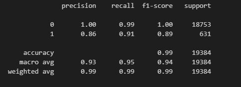

# Credit Risk Classification (Supervised Machine Learning Model)

## Overview of the Analysis

* The purpose of this analysis is to build a model that can identify the creditworthiness of borrowers.
* A dataset of historical lending activity from a peer-to-peer lending services company was used. 
* Dependant variable (y value) in this analysis was the "loan status" indicating if a loan is healthy or at risk. 
* Independent Variables (x values) were loan size, interest rate, borrower income, debt to income ratio, number of accounts and derogatory marks.
* In this analysis, we first split our data to traning and test sets. Then, define our dependent and independent variables. Next, we create logistic regression model and fit our original data to this model. Trained model is used to make predictions. Lastly, we evaluate the model`s performance. 
* Two diffeent Logistic Regression models were created by using the original data set and randomy over resampled data set (to get rid of the imbalances). In the end, their results -which was gathered with scikit-learn library- were compared.

## Results

* Logistic Regression Model with Original Data
 

* Logistic Regression Model with Randomly Oversampled Data

## Summary

Analysis show that collected data can be effectively used to train and test the Machine Learning Classification Model. For better preditions solving the imbalance sampling issue is needed.

Randomly oversampling the data helps us to get higher balanced accuracy and recall scores. With higher recall value, model can predict risky loans more accurately.

With incorrect predictions we have two issues:

* False positives (where users are flagged as risky, but are actually healthy)
* False negatives (where users are not flagged as risky but are actually risky)

both cases have its costs. It is important to predict both 1`s and 0`s. Therefore, model should have good accuracy in terms of both. 
